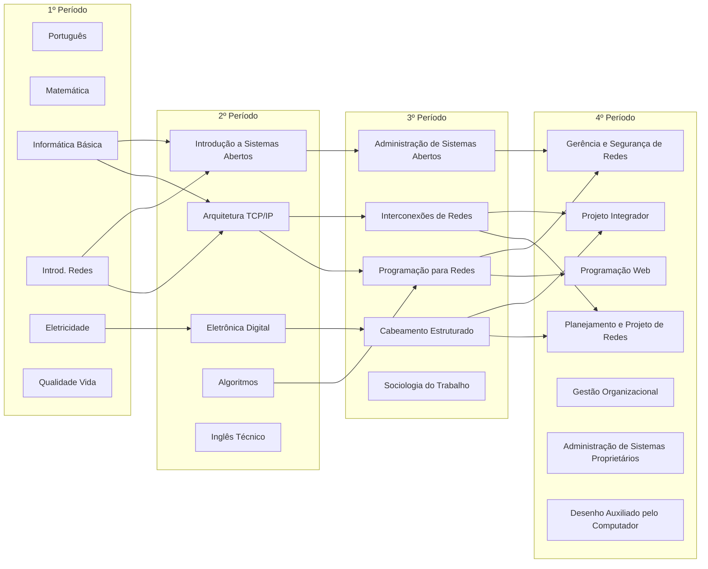

# Início

## Programa das disciplinas

- [Administração de Sistemas Abertos ](administracao-de-sistemas-abertos.md)
- [Administração de Sistemas Proprietários ](administracao-de-sistemas-proprietarios.md)
- [Algoritmos ](algoritmos.md)
- [Arquitetura TCP/IP](arquitetura-tcpip.md)
- [Cabeamento Estruturado e Redes de Acesso ](cabeamento-estruturado-e-redes-de-acesso.md)
- [CAD ](cad.md)
- [Eletricidade ](eletricidade.md)
- [Eletrônica Digital ](eletronica-digital.md)
- [Gerência e Segurança de Redes ](gerencia-e-seguranca-de-redes.md)
- [Gestão Organizacional ](gestao-organizacional.md)
- [Informática Básica ](informatica-basica.md)
- [Inglês Técnico ](ingles-tecnico.md)
- [Interconexão de Redes ](interconexao-de-redes.md)
- [Introdução a Sistemas Abertos ](introducao-a-sistemas-abertos.md)
- [Introdução às Redes de Computadores ](introducao-as-redes-de-computadores.md)
- [Língua Portuguesa ](lingua-portuguesa.md)
- [Matemática ](matematica.md)
- [Planejamento e Projeto de Redes ](planejamento-e-projeto-de-redes.md)
- [Programação para Redes ](programacao-para-redes.md)
- [Programação Web](programacao-web.md)
- [Projeto integrador](projeto-integrador.md)
- [Qualidade de Vida e Trabalho ](qualidade-de-vida-e-trabalho.md)
- [Sociologia do Trabalho ](sociologia-do-trabalho.md)
