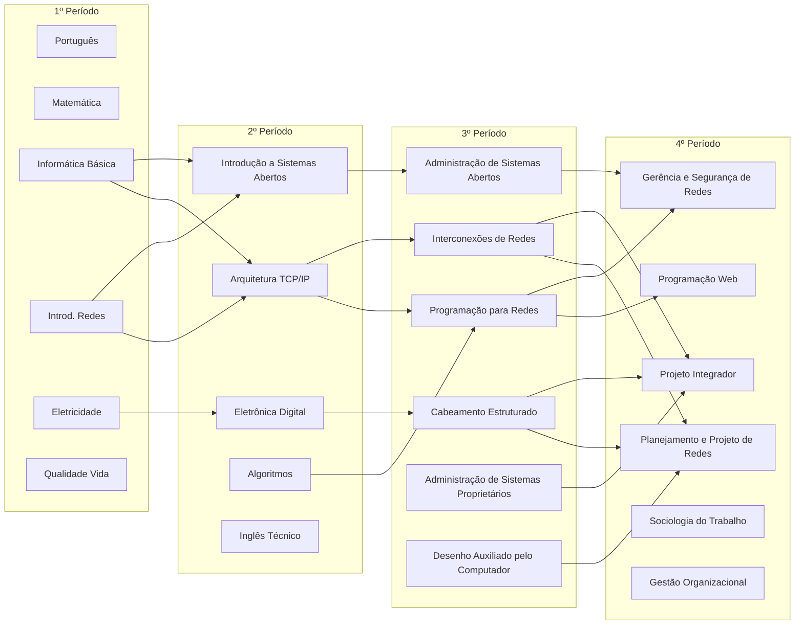

# Técnico Subsequente em Redes de Computadores

```mermaid

graph LR
    subgraph "1º Período"
        POR["Português"]
        MAT["Matemática"]
        INF["Informática Básica"]
        RED["Introd. Redes"]
        ELE["Eletricidade"]
        QVI["Qualidade Vida"]        
    end

    RED --> ISA & TCP
    ELE --> ELD
    INF --> ISA & TCP

    subgraph "2º Período"
        ALG["Algoritmos"]
        ISA["Introdução a Sistemas Abertos"]
        TCP["Arquitetura TCP/IP"]
        ELD["Eletrônica Digital"]
        ING["Inglês Técnico"]
    end
    
    TCP --> INT
    ALG & TCP --> PRE
    ISA --> ASA
    ELD --> CAB

    subgraph "3º Período"
        ASA["Administração de Sistemas Abertos"]
        CAB["Cabeamento Estruturado"]
        INT["Interconexões de Redes"]
        PRE["Programação para Redes"]
        ASP["Administração de Sistemas Proprietários"]
        CAD["Desenho Auxiliado pelo Computador"]
    end

    CAB & INT & ASP --> PI1
    ASA & PRE --> SEG
    PRE --> PRW
    CAB & CAD --> PPR
    INT --> PPR

    subgraph "4º Período"
        PPR["Planejamento e Projeto de Redes"]
        PRW["Programação Web"]
        SEG["Gerência e Segurança de Redes"]
        PI1["Projeto Integrador"]
        SOC["Sociologia do Trabalho"]
        GOR["Gestão Organizacional"]
    end
```
